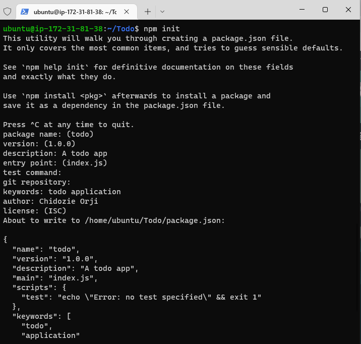
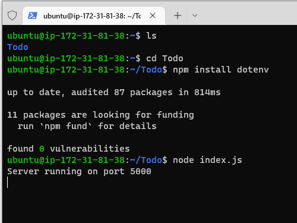
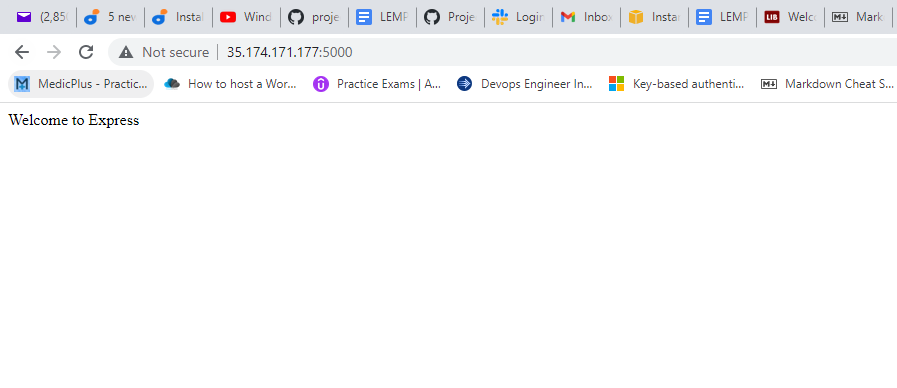
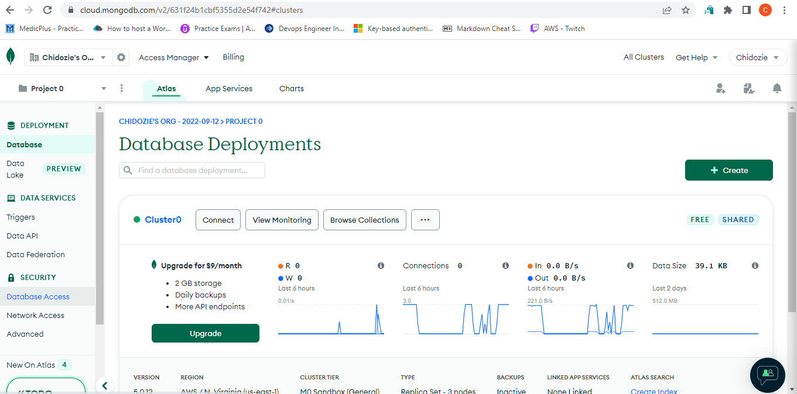

## Awesome Documentation of project 3

`sudo apt update`

`sudo apt upgrade`

<!--- get the location of Node.js software from Ubuntu repositories. -->

`curl -fsSL https://deb.nodesource.com/setup_18.x | sudo -E bash -`

`sudo apt-get install -y nodejs`

`node -v`

`npm -v`

`mkdir Todo`

`cd Todo`

`npm init`



<!-- INSTALL EXPRESS.JS  Remember that Express is a framework for Node.js, therefore a lot of things developers would have programmed is already taken care of out of the box. Therefore it simplifies development, and abstracts a lot of low level details. For example, Express helps to define routes of your application based on HTTP methods and URLs.-->

`npm install express`

`touch index.js`

`npm install dotenv`

`vim index.js`

``` javascript
const express = require('express');
require('dotenv').config();

const app = express();

const port = process.env.PORT || 5000;

app.use((req, res, next) => {
res.header("Access-Control-Allow-Origin", "\*");
res.header("Access-Control-Allow-Headers", "Origin, X-Requested-With, Content-Type, Accept");
next();
});

app.use((req, res, next) => {
res.send('Welcome to Express');
});

app.listen(port, () => {
console.log(`Server running on port ${port}`)
});  

```

Now it is time to start our server to see if it works. Open your terminal in the same directory as your index.js file and type: 

`node index.js`

If every thing goes well, you should see Server running on port 5000 in your terminal.



created an inbound rule to open TCP port 5000

`http://44.204.43.55/>:5000`



**ROUTES**

`mkdir routes`

`cd routes`

`touch api.js`

`vim api.js`

``` javascript
const express = require ('express');
const router = express.Router();

router.get('/todos', (req, res, next) => {

});

router.post('/todos', (req, res, next) => {

});

router.delete('/todos/:id', (req, res, next) => {

})

module.exports = router;
```

**MODELS**

Change directory back Todo folder with `cd ..` and install Mongoose

`npm install mongoose`

`mkdir models`

`cd models`

`touch todo.js`

or

`mkdir models && cd models && touch todo.js`

Open the file created with `vim todo.js` then paste the code below in the file:

``` javascript
const mongoose = require('mongoose');
const Schema = mongoose.Schema;

//create schema for todo
const TodoSchema = new Schema({
action: {
type: String,
required: [true, 'The todo text field is required']
}
})

//create model for todo
const Todo = mongoose.model('todo', TodoSchema);

module.exports = Todo; 
```

Now we need to update our routes from the file `api.js` in ‘routes’ directory to make use of the new model.

In Routes directory, open api.js with `vim api.js`, delete the code inside with `:%d` command and paste there code below into it then save and exit

``` javascript
const express = require ('express');
const router = express.Router();
const Todo = require('../models/todo');

router.get('/todos', (req, res, next) => {

//this will return all the data, exposing only the id and action field to the client
Todo.find({}, 'action')
.then(data => res.json(data))
.catch(next)
});

router.post('/todos', (req, res, next) => {
if(req.body.action){
Todo.create(req.body)
.then(data => res.json(data))
.catch(next)
}else {
res.json({
error: "The input field is empty"
})
}
});

router.delete('/todos/:id', (req, res, next) => {
Todo.findOneAndDelete({"_id": req.params.id})
.then(data => res.json(data))
.catch(next)
})

module.exports = router;
```


**MONGODB DATABASE**

We need a database where we will store our data. For this we will make use of mLab. mLab provides MongoDB database as a service solution (DBaaS)



Create a file in your `Todo` directory and name it `.env`.

` touch .env`

`vi .env`

Add the connection string to access the database in it, just as below:

`DB = 'mongodb+srv://<username>:<password>@<network-address>/<dbname>?retryWrites=true&w=majority'`

Ensure to update `<username>, <password>, <network-address>` and `<database>` according to your setup


Now we need to update the `index.js` to reflect the use of `.env` so that Node.js can connect to the database.

Simply delete existing content in the file, and update it with the entire code below.

To do that using `vim`, follow below steps

1. Open the file with `vim index.js`

2. Press `esc`

3. Type `:`

4. Type `%d`

5. Hit ‘Enter’
The entire content will be deleted, then,

6. Press `i` to enter the insert mode in vim

7. Now, paste the entire code below in the file.

``` javascript const express = require('express');
const bodyParser = require('body-parser');
const mongoose = require('mongoose');
const routes = require('./routes/api');
const path = require('path');
require('dotenv').config();

const app = express();

const port = process.env.PORT || 5000;

//connect to the database
mongoose.connect(process.env.DB, { useNewUrlParser: true, useUnifiedTopology: true })
.then(() => console.log(`Database connected successfully`))
.catch(err => console.log(err));

//since mongoose promise is depreciated, we overide it with node's promise
mongoose.Promise = global.Promise;

app.use((req, res, next) => {
res.header("Access-Control-Allow-Origin", "\*");
res.header("Access-Control-Allow-Headers", "Origin, X-Requested-With, Content-Type, Accept");
next();
});

app.use(bodyParser.json());

app.use('/api', routes);

app.use((err, req, res, next) => {
console.log(err);
next();
});

app.listen(port, () => {
console.log(`Server running on port ${port}`)
}); 
```

Start your server using the command:

`node index.js`

You shall see a message **‘Database connected successfully’**, if so – we have our backend configured. Now we are going to test it.

### Testing Backend Code without Frontend using RESTful API

In this project, we will use **Postman** to test our API

Now open your Postman, create a POST request to the API `http://<PublicIP-or-PublicDNS>:5000/api/todos`. This request sends a new task to our To-Do list so the application could store it in the database.

**Note**: make sure your set header key `Content-Type` as `application/json`

.PNG)

.PNG)

Create a GET request to your API on `http://<PublicIP-or-PublicDNS>:5000/api/todos`. This request retrieves all existing records from out To-do application (backend requests these records from the database and sends it us back as a response to GET request).

.PNG)


- [x]Display a list of tasks – HTTP GET request
- [x]Add a new task to the list – HTTP POST request
- [x]Delete an existing task from the list – HTTP DELETE request
