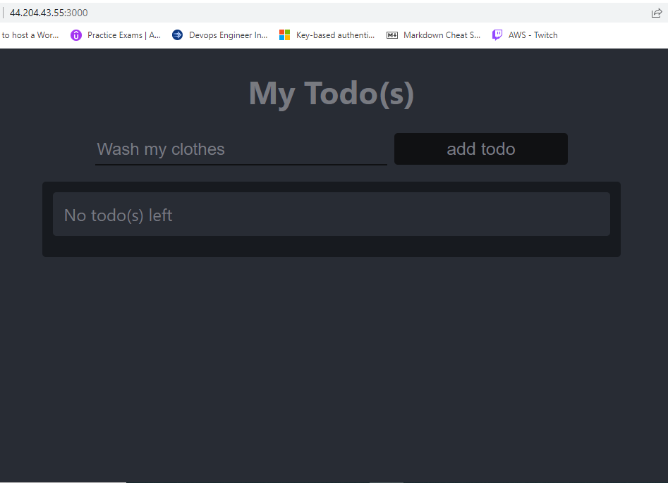

## Awesome Documentation of project 3

`sudo apt update`

`sudo apt upgrade`

<!--- get the location of Node.js software from Ubuntu repositories. -->

`curl -fsSL https://deb.nodesource.com/setup_18.x | sudo -E bash -`

`sudo apt-get install -y nodejs`

`node -v`

`npm -v`

`mkdir Todo`

`cd Todo`

`npm init`


INSTALL EXPRESS.JS  Remember that Express is a framework for Node.js, therefore a lot of things developers would have programmed is already taken care of out of the box. Therefore it simplifies development, and abstracts a lot of low level details. For example, Express helps to define routes of your application based on HTTP methods and URLs.

`npm install express`

`touch index.js`

`npm install dotenv`

`vim index.js`

``` javascript
const express = require('express');
require('dotenv').config();

const app = express();

const port = process.env.PORT || 5000;

app.use((req, res, next) => {
res.header("Access-Control-Allow-Origin", "\*");
res.header("Access-Control-Allow-Headers", "Origin, X-Requested-With, Content-Type, Accept");
next();
});

app.use((req, res, next) => {
res.send('Welcome to Express');
});

app.listen(port, () => {
console.log(`Server running on port ${port}`)
});  

```

Now it is time to start our server to see if it works. Open your terminal in the same directory as your index.js file and type: 

`node index.js`

If every thing goes well, you should see Server running on port 5000 in your terminal.


created an inbound rule to open TCP port 5000

`http://44.204.43.55:5000`


### ROUTES

`mkdir routes`

`cd routes`

`touch api.js`

`vim api.js`

``` javascript
const express = require ('express');
const router = express.Router();

router.get('/todos', (req, res, next) => {

});

router.post('/todos', (req, res, next) => {

});

router.delete('/todos/:id', (req, res, next) => {

})

module.exports = router;
```

### MODELS

Change directory back Todo folder with `cd ..` and install Mongoose

`npm install mongoose`

`mkdir models`

`cd models`

`touch todo.js`

or

`mkdir models && cd models && touch todo.js`

Open the file created with `vim todo.js` then paste the code below in the file:

``` javascript
const mongoose = require('mongoose');
const Schema = mongoose.Schema;

//create schema for todo
const TodoSchema = new Schema({
action: {
type: String,
required: [true, 'The todo text field is required']
}
})

//create model for todo
const Todo = mongoose.model('todo', TodoSchema);

module.exports = Todo; 
```

Now we need to update our routes from the file `api.js` in ‘routes’ directory to make use of the new model.

In Routes directory, open api.js with `vim api.js`, delete the code inside with `:%d` command and paste there code below into it then save and exit

``` javascript
const express = require ('express');
const router = express.Router();
const Todo = require('../models/todo');

router.get('/todos', (req, res, next) => {

//this will return all the data, exposing only the id and action field to the client
Todo.find({}, 'action')
.then(data => res.json(data))
.catch(next)
});

router.post('/todos', (req, res, next) => {
if(req.body.action){
Todo.create(req.body)
.then(data => res.json(data))
.catch(next)
}else {
res.json({
error: "The input field is empty"
})
}
});

router.delete('/todos/:id', (req, res, next) => {
Todo.findOneAndDelete({"_id": req.params.id})
.then(data => res.json(data))
.catch(next)
})

module.exports = router;
```


### MONGODB DATABASE

We need a database where we will store our data. For this we will make use of mLab. mLab provides MongoDB database as a service solution (DBaaS)


Create a file in your `Todo` directory and name it `.env`.

` touch .env`

`vi .env`

Add the connection string to access the database in it, just as below:

`DB = 'mongodb+srv://<username>:<password>@<network-address>/<dbname>?retryWrites=true&w=majority'`

Ensure to update `<username>, <password>, <network-address>` and `<database>` according to your setup


Now we need to update the `index.js` to reflect the use of `.env` so that Node.js can connect to the database.

Simply delete existing content in the file, and update it with the entire code below.

To do that using `vim`, follow below steps

1. Open the file with `vim index.js`

2. Press `esc`

3. Type `:`

4. Type `%d`

5. Hit ‘Enter’
The entire content will be deleted, then,

6. Press `i` to enter the insert mode in vim

7. Now, paste the entire code below in the file.

``` javascript const express = require('express');
const bodyParser = require('body-parser');
const mongoose = require('mongoose');
const routes = require('./routes/api');
const path = require('path');
require('dotenv').config();

const app = express();

const port = process.env.PORT || 5000;

//connect to the database
mongoose.connect(process.env.DB, { useNewUrlParser: true, useUnifiedTopology: true })
.then(() => console.log(`Database connected successfully`))
.catch(err => console.log(err));

//since mongoose promise is depreciated, we overide it with node's promise
mongoose.Promise = global.Promise;

app.use((req, res, next) => {
res.header("Access-Control-Allow-Origin", "\*");
res.header("Access-Control-Allow-Headers", "Origin, X-Requested-With, Content-Type, Accept");
next();
});

app.use(bodyParser.json());

app.use('/api', routes);

app.use((err, req, res, next) => {
console.log(err);
next();
});

app.listen(port, () => {
console.log(`Server running on port ${port}`)
}); 
```

Start your server using the command:

`node index.js`

You shall see a message **‘Database connected successfully’**, if so – we have our backend configured. Now we are going to test it.

### Testing Backend Code without Frontend using RESTful API

In this project, we will use **Postman** to test our API

Now open your Postman, create a POST request to the API `http://<PublicIP-or-PublicDNS>:5000/api/todos`. This request sends a new task to our To-Do list so the application could store it in the database.

**Note**: make sure your set header key `Content-Type` as `application/json`

.PNG)


.PNG)

Create a GET request to your API on `http://<PublicIP-or-PublicDNS>:5000/api/todos`. This request retrieves all existing records from out To-do application (backend requests these records from the database and sends it us back as a response to GET request).

.PNG)


- [x]Display a list of tasks – HTTP GET request
- [x]Add a new task to the list – HTTP POST request
- [x]Delete an existing task from the list – HTTP DELETE request


### FRONTEND CREATION

To start out with the frontend of the To-do app, we will use the `create-react-app` command to scaffold our app.

In the same root directory as your backend code, which is the Todo directory, run:

`npx create-react-app client`

This will create a new folder in your `Todo` directory called `client`, where you will add all the react code.

**Running a React App**
1. Install `concurrently`. It is used to run more than one command simultaneously from the same terminal window.

`npm install concurrently --save-dev`

2. Install `nodemon`. It is used to run and monitor the server. If there is any change in the server code, nodemon will restart it automatically and load the new changes.

`npm install nodemon --save-dev`

3. In `Todo` folder open the `package.json` file. Change the highlighted part of the below screenshot and replace with the code below.

``` bootstrap 
"scripts": {
"start": "node index.js",
"start-watch": "nodemon index.js",
"dev": "concurrently \"npm run start-watch\" \"cd client && npm start\""
},
```


**Configure Proxy in** `package.json`

1. Change directory to `‘client’`

`cd client`

2. Open the `package.json` file

`vi package.json`

3. Add the key value pair in the package.json file `"proxy": "http://localhost:5000"`.

The whole purpose of adding the proxy configuration in number 3 above is to make it possible to access the application directly from the browser by simply calling the server url like `http://localhost:5000` rather than always including the entire path like `http://localhost:5000/api/todos`

Now, ensure you are inside the `Todo` directory, and simply do:

`npm run dev`

Your app should open and start running on `localhost:3000`

**Important note**: In order to be able to access the application from the Internet you have to open TCP port 3000 on EC2 by adding a new Security Group rule. You already know how to do it.

One of the advantages of react is that it makes use of components, which are reusable and also makes code modular. For our Todo app, there will be two stateful components and one stateless component.
From your Todo directory run

`cd client`

move to the src directory

`cd src`

Inside your `src` folder create another folder called `components`

`mkdir components`

Move into the components directory with

`cd components`

Inside `‘components’` directory create three files `Input.js`, `ListTodo.js` and `Todo.js`.

`touch Input.js ListTodo.js Todo.js`

Open `Input.js` file

`vi Input.js`

Copy and paste the following

``` javascript 
import React, { Component } from 'react';
import axios from 'axios';

class Input extends Component {

state = {
action: ""
}

addTodo = () => {
const task = {action: this.state.action}

    if(task.action && task.action.length > 0){
      axios.post('/api/todos', task)
        .then(res => {
          if(res.data){
            this.props.getTodos();
            this.setState({action: ""})
          }
        })
        .catch(err => console.log(err))
    }else {
      console.log('input field required')
    }

}

handleChange = (e) => {
this.setState({
action: e.target.value
})
}

render() {
let { action } = this.state;
return (
<div>
<input type="text" onChange={this.handleChange} value={action} />
<button onClick={this.addTodo}>add todo</button>
</div>
)
}
}

export default Input
```

To make use of `Axios`, which is a Promise based HTTP client for the browser and node.js, you need to cd into your client from your terminal and run yarn add axios or npm install axios.

Move to the `src` folder

`cd ..`

Move to `clients` folder

`cd ..`

Install Axios

`npm install axios`

Go to `‘components’` directory

`cd src/components`

After that open your `ListTodo.js`

`vi ListTodo.js`

in the `ListTodo.js` copy and paste the following code

``` javascript 
import React from 'react';

const ListTodo = ({ todos, deleteTodo }) => {

return (
<ul>
{
todos &&
todos.length > 0 ?
(
todos.map(todo => {
return (
<li key={todo._id} onClick={() => deleteTodo(todo._id)}>{todo.action}</li>
)
})
)
:
(
<li>No todo(s) left</li>
)
}
</ul>
)
}

export default ListTodo
```

Then in your `Todo.js` file you write the following code

``` javascript
import React, {Component} from 'react';
import axios from 'axios';

import Input from './Input';
import ListTodo from './ListTodo';

class Todo extends Component {

state = {
todos: []
}

componentDidMount(){
this.getTodos();
}

getTodos = () => {
axios.get('/api/todos')
.then(res => {
if(res.data){
this.setState({
todos: res.data
})
}
})
.catch(err => console.log(err))
}

deleteTodo = (id) => {

    axios.delete(`/api/todos/${id}`)
      .then(res => {
        if(res.data){
          this.getTodos()
        }
      })
      .catch(err => console.log(err))

}

render() {
let { todos } = this.state;

    return(
      <div>
        <h1>My Todo(s)</h1>
        <Input getTodos={this.getTodos}/>
        <ListTodo todos={todos} deleteTodo={this.deleteTodo}/>
      </div>
    )

}
}

export default Todo;
```

We need to make little adjustment to our react code. Delete the logo and adjust our `App.js` to look like this.

Move to the `src` folder

`cd ..`

Make sure that you are in the `src` folder and run

`vi App.js`

Copy and paste the code below into it

``` javascript
import React from 'react';

import Todo from './components/Todo';
import './App.css';

const App = () => {
return (
<div className="App">
<Todo />
</div>
);
}

export default App;
```

After pasting, exit the editor.

In the src directory open the `App.css`

Then paste the following code into `App.css`:

``` javascript
.App {
text-align: center;
font-size: calc(10px + 2vmin);
width: 60%;
margin-left: auto;
margin-right: auto;
}

input {
height: 40px;
width: 50%;
border: none;
border-bottom: 2px #101113 solid;
background: none;
font-size: 1.5rem;
color: #787a80;
}

input:focus {
outline: none;
}

button {
width: 25%;
height: 45px;
border: none;
margin-left: 10px;
font-size: 25px;
background: #101113;
border-radius: 5px;
color: #787a80;
cursor: pointer;
}

button:focus {
outline: none;
}

ul {
list-style: none;
text-align: left;
padding: 15px;
background: #171a1f;
border-radius: 5px;
}

li {
padding: 15px;
font-size: 1.5rem;
margin-bottom: 15px;
background: #282c34;
border-radius: 5px;
overflow-wrap: break-word;
cursor: pointer;
}

@media only screen and (min-width: 300px) {
.App {
width: 80%;
}

input {
width: 100%
}

button {
width: 100%;
margin-top: 15px;
margin-left: 0;
}
}

@media only screen and (min-width: 640px) {
.App {
width: 60%;
}

input {
width: 50%;
}

button {
width: 30%;
margin-left: 10px;
margin-top: 0;
}
}
```

Exit

In the `src` directory open the `index.css`

`vim index.css`

Copy and paste the code below:

``` css 
body {
margin: 0;
padding: 0;
font-family: -apple-system, BlinkMacSystemFont, "Segoe UI", "Roboto", "Oxygen",
"Ubuntu", "Cantarell", "Fira Sans", "Droid Sans", "Helvetica Neue",
sans-serif;
-webkit-font-smoothing: antialiased;
-moz-osx-font-smoothing: grayscale;
box-sizing: border-box;
background-color: #282c34;
color: #787a80;
}

code {
font-family: source-code-pro, Menlo, Monaco, Consolas, "Courier New",
monospace;
}
```

Go to the `Todo` directory

`cd ../..`

When you are in the `Todo` directory run:

`npm run dev`

Assuming no errors when saving all these files, our To-Do app should be ready and fully functional with the functionality discussed earlier: creating a task, deleting a task and viewing all your tasks.




## Congratulations


